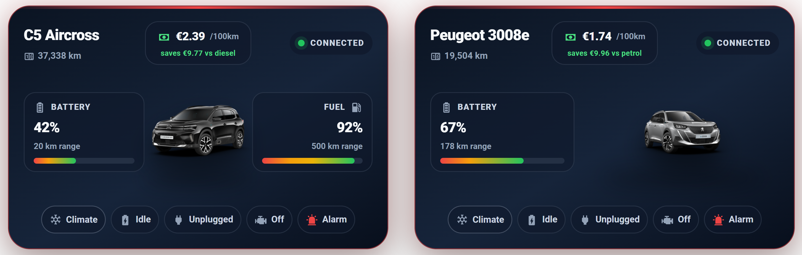
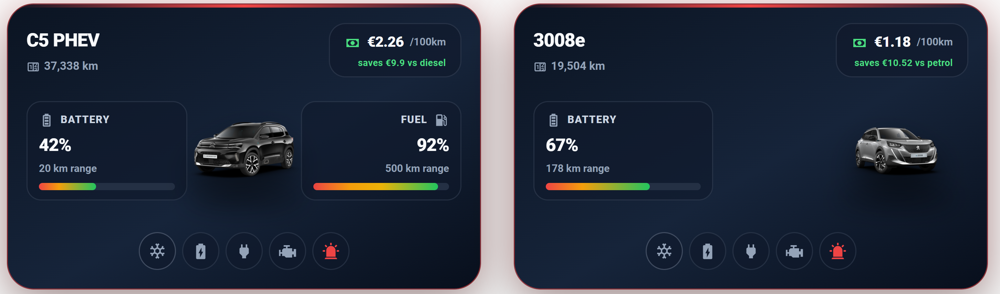

# Stellantis Vehicle Card

Custom Home Assistant Lovelace cards for Stellantis vehicles (Citroën, Peugeot, Opel, DS, Fiat) connected through the
[homeassistant-stellantis-vehicles](https://github.com/andreadegiovine/homeassistant-stellantis-vehicles) integration.

The package ships **two cards**:

- **`stellantis-custom-vehicle-card`** — a full dashboard card: a hero layout with the vehicle image flanked by battery (and fuel) gauges, a live charging animation, a charging strip (rate · ready-by · target), a cost-per-100km highlight band with savings vs fuel, status chips, vehicle-detail stats, and climate / wake remote controls.
- **`stellantis-custom-vehicle-compact-card`** — a compact status card centered on the vehicle image, with the cost badge in the header, battery/fuel metrics, the charging strip, status pills, a state-based accent glow (green charging / amber low battery / red alarm), and a configurable icon-badge direction.

A single card type serves **any** Stellantis vehicle — just point it at that car's entities. Works for hybrids and pure EVs (`hide_fuel`).

## Screenshots

### Full card



### Compact card



## Installation

### HACS (recommended)

1. In HACS, go to the three-dot menu → **Custom repositories**.
2. Add `https://github.com/ac-uy/ha-stellantis-vehicle-card` with category **Dashboard** (Lovelace).
3. Search for **Stellantis Vehicle Card** and download it.
4. Hard-refresh your browser (Ctrl+Shift+R).

HACS registers the resource automatically. If you add the resource manually, point it at
`/hacsfiles/ha-stellantis-vehicle-card/stellantis-vehicle-card.js` as a **JavaScript module**.

### Manual

1. Copy `stellantis-vehicle-card.js` to `/config/www/`.
2. Add a dashboard resource: **Settings → Dashboards → ⋮ → Resources → Add**, URL `/local/stellantis-vehicle-card.js`, type **JavaScript Module**.
3. Hard-refresh your browser.

## Usage

Both cards read sensible defaults, but you should pass your vehicle's `entities`, `image`, and `title`.

### Full card

```yaml
type: custom:stellantis-custom-vehicle-card
title: Peugeot 3008e
eyebrow: MY PEUGEOT
subtitle: Electric · Garage · Connected vehicle
hide_fuel: true
save_label: saved vs petrol
fuel_baseline: 11.7   # €/100km reference for the savings figure
image: /local/stellantis_vehicles/<account>/<VIN>.png
entities:
  battery: sensor.garage_peugeot_3008e_battery
  electricRange: sensor.garage_peugeot_3008e_range
  mileage: sensor.garage_peugeot_3008e_mileage
  cabin: sensor.garage_peugeot_3008e_temperature
  serviceBattery: sensor.garage_peugeot_3008e_service_battery
  lastTrip: sensor.garage_peugeot_3008e_last_trip
  lastCharge: sensor.garage_peugeot_3008e_last_charge
  batteryHealth: sensor.garage_peugeot_3008e_battery_soh_capacity
  chargingRate: sensor.garage_peugeot_3008e_battery_charging_rate
  chargingEnd: sensor.garage_peugeot_3008e_battery_charging_end
  chargeLimit: number.garage_peugeot_3008e_battery_charging_limit
  costPer100km: sensor.peugeot_3008e_cost_per_100km
  charging: binary_sensor.garage_peugeot_3008e_battery_charging
  plugged: binary_sensor.garage_peugeot_3008e_battery_plugged
  climate: binary_sensor.garage_peugeot_3008e_preconditioning
  engine: binary_sensor.garage_peugeot_3008e_engine
  alarm: binary_sensor.garage_peugeot_3008e_alarm
  connected: binary_sensor.garage_peugeot_3008e_remote_commands
  climateStart: button.garage_peugeot_3008e_preconditioning_start
  climateStop: button.garage_peugeot_3008e_preconditioning_stop
  wake: button.garage_peugeot_3008e_wakeup
```

### Compact card

```yaml
type: custom:stellantis-custom-vehicle-compact-card
title: Peugeot 3008e
hide_fuel: true
pills_icons_only: true
save_label: vs petrol
fuel_baseline: 11.7
image: /local/stellantis_vehicles/<account>/<VIN>.png
entities:
  battery: sensor.garage_peugeot_3008e_battery
  electricRange: sensor.garage_peugeot_3008e_range
  mileage: sensor.garage_peugeot_3008e_mileage
  charging: binary_sensor.garage_peugeot_3008e_battery_charging
  chargingRate: sensor.garage_peugeot_3008e_battery_charging_rate
  chargingEnd: sensor.garage_peugeot_3008e_battery_charging_end
  chargeLimit: number.garage_peugeot_3008e_battery_charging_limit
  costPer100km: sensor.peugeot_3008e_cost_per_100km
  plugged: binary_sensor.garage_peugeot_3008e_battery_plugged
  climate: binary_sensor.garage_peugeot_3008e_preconditioning
  engine: binary_sensor.garage_peugeot_3008e_engine
  alarm: binary_sensor.garage_peugeot_3008e_alarm
  connected: binary_sensor.garage_peugeot_3008e_remote_commands
  climateStart: button.garage_peugeot_3008e_preconditioning_start
  climateStop: button.garage_peugeot_3008e_preconditioning_stop
  wake: button.garage_peugeot_3008e_wakeup
```

## Options

| Option | Type | Default | Description |
|--------|------|---------|-------------|
| `title` | string | `C5 Aircross` | Card title / vehicle name. |
| `eyebrow` | string | `MY CITROËN` | Small label above the title (full card). |
| `subtitle` | string | `Hybrid · Garage · Connected vehicle` | Subtitle line (full card). |
| `image` | string | C5 default | Vehicle image URL (the integration stores one under `/local/stellantis_vehicles/...`). |
| `hide_fuel` | boolean | `false` | Hide the fuel gauge/metric for pure EVs and rebalance the layout. |
| `fuel_baseline` | number | `12.16` | €/100km reference used for the "saved vs fuel" figure in the cost band (full card). |
| `save_label` | string | `saved vs diesel` (full) / `vs diesel` (compact) | Label next to the savings value. |
| `pills_icons_only` | boolean | `false` | Compact card: collapse the status pills to circular icon-only badges (state text stays on hover). |
| `entities` | map | C5 defaults | Entity overrides (see examples above). |

### `entities` keys

`battery`, `electricRange`, `fuel`, `fuelRange`, `mileage`, `cabin`, `coolant`, `serviceBattery`,
`lastTrip`, `lastCharge`, `batteryHealth`, `chargingRate`, `chargingEnd`, `chargeLimit`,
`chargeLimitEnabled`, `costPer100km`, `charging`, `plugged`, `climate`, `engine`, `alarm`,
`connected`, `climateStart`, `climateStop`, `wake`.

The `costPer100km` entity is optional — create a simple template sensor
(`efficiency kWh/100km × charging price €/kWh`) if you want the cost band populated.

The `chargeLimitEnabled` entity (the vehicle's charge-limit switch) is optional. When
provided, the charging strip only shows the configured charge target (e.g. "to 80%")
while that switch is on; otherwise it shows "to 100%". Without it, the card falls back
to showing the raw `chargeLimit` value when positive.

## Credits

Built for use with Andrea De Giovine's
[homeassistant-stellantis-vehicles](https://github.com/andreadegiovine/homeassistant-stellantis-vehicles)
integration. Not affiliated with Stellantis.

## License

[MIT](LICENSE)
